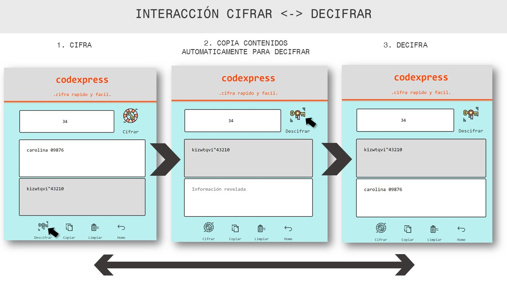

## *C0DEXPRESS: cifra y comparta mensajes importantes rapido y facil *

En un mundo en que todo sucede a alta velocidad, no nos damos cuenta de las condiciones de seguridad que compartimos nuestras informaciónes personales en las redes como facebook, whatsapp, slack y telegram. Enviamos cuentas de banco, RUT o números de tarjeta de crédito sin saber si estamos en un ambiente seguro. ¿Y si pudiéramos compartir estas informaciones solamente con quien la solicitó y de la manera más segura posible, rápido y fácil?

*C0dexpress*, como dice el nombre, permite que esta información tan importante sea más segura utilizando, como ejemplo la Cifra Cesar. La aplicación, que se puede abrir en escritorio o instalada en las *plataformas Android y OS*, permite cifrar y descifrar los mensajes sólo por quien posee la clave secreta, que consiste en un número a ser escogido por la persona que va a codificar.

Esta herramienta es para *personas con la vida muy ágil y digital*, que utilizan las redes sociales como principales medios de comunicación en sus cotidianos. Que comparten informaciones importantes con sus clientes, amigos o familia.

En un primero momento, Codexpress es basado en el Cifrado César, un tipo de crifado por sustitución, es decir, que cada letra del texto original es reemplazada por otra, que se encuentra a un número fijo de posiciones más adelante en el mismo alfabeto, dependiente de la clave elejida. Todavia, aún este es un prototipo de una aplicación que pretende incorporar, en el futuro, otros modelos de cifrado y herramientas de creación de contraseñas, junto a la posibilidad de cambio de alfabeto de acuerdo con el idioma escogido.

## *Decisiones de Diseño y interacción con el usuário*

Como concepto principal de diseño, fue pensado en la agilidad, camino intuitivo y interfaz atractiva y leve, similar a las actuales redes sociales.

#### *Diagrama de flujo*

Idea es que la aplicación sea bastante fluida entre las secciones, pensando en una navegación simple, con el mínimo de clicks entre pantallas.

***

#### *Prototipo de baja fidelidad*

Después de trabajar la circulación entre pantallas, el prototipo de baja fidelidad fue un importante aliado para definir las funciones internas de la aplicación - pensando en la facilidad para que el usuario pase de cifrar para descifrar, teniendo la posibilidad de haber copiado las informaciones entre las secciones. Posibilidad de copiar para el "clipboard" y limpiar la pantalla. Trabajar con iconos entretenidos y palabras simples.

***
#### *Investigación de sitios web y definicion del lenguaje de interface*

La investigación de referencias fue enfocada en empresas y aplicaciones que reflejen agilidad, tranquilidad, frescor y tecnología: las nuevas fintechs, que con su *agilidad y practicidad* conquistaron muchos usuarios, los traductores de lenguas más practicos y finalmente las redes sociales que ya son parte fundamental de las interacciones sociales actualmente. 

Los colores *naranja y turquesa* fueron los elegidos como principales, siendo complementarios junto a colores más neutros como el gris y naranja claro, *trayendo frescor, tranquilidad y amistad*.
Para estudio de colores fue utilizadas herramientas digitales de paleta de colores cómo "paletton.com", "coolors.co" y "colorzilla".

***

#### *Tests intermedio con usuários*

Antes de llegar a una versión final, se recibieron algunos comentarios de usuarios, observando su reacción y relación con los colores, la estetica y funcionalidades: 
- Fuertes identificaciones con los colores y fuentes escogidas - confianza, tranquilidad y sensación de armonía y frescor. 
- Necesidad de aumentar las fuentes y iconos. 
- Diferenciar los iconos cifrar y descifrar .
- Diferenciar mejor lo que es la funcion de cifrado y lo que es navegación, con sugerencia de cambio de posicionamento de los botones y áreas de texto para que quedara más responsivo.
- Cambiar el orden de los iconos. Mejoras en el contenido del manual de instrucciones. 
- Sugiero utilizar palabras más sencillas. 
- Mejorar la interfaz entre la función cifrar y descifrar - copiar el cconteudo de uno a otro.
***

## *Interface Final*

Después de las pruebas, se hicieron ultimas modificaciones en la interfaz, que ya configura su versión final.
***

#### *Pantalla principal*

En la pantalla principal, el usuario puede elijir se quiere acceder al guión , cifrar o decifrar su información, a través de botones interactivos e iconos atractivos que se relacionan con sus funciones.

***

#### *Guión para el usuário*

Nesta sección el usuario encontrará las informaciones sobre el cifrado Cesar, instrucciones de uso y politica de privacidad del usuario, trayendo más confianza y seriedad a la aplicación, con la posibilidad de volver a la pantalla principal.

***

#### *Cifrando y decigfrando las informaciónes personales*

Para el desarrollo del diseño de las secoes cifrar y descifrar, se realizaron algunas pruebas con usuarios para observar
- *Clave secreta* - Elegir un desplazamiento (la clave que al cifrar, debe ser guardada), o insertar la clave recibida, indicando cuántas posiciones queremos que el cifrado desplace cada caracter.
- *Insertar texto* - Insertar un mensaje (texto) a cifrar o decifrar.
- *Resultado final* - Información cifrada o decifrada.

- La funccion copiar para clipboard para que el usuario comparta el mensaje.
- Funcción limpiar para cifrar o decifrar outro texto.
- Volver a pantalla principal
- Interacción Cifrar o decifrar - despues que cumplir con cifrar, por ejemplo, el usuario puede directamente ir a pantalla decifrar, tenendo sus *informaciones automaticamente copiadas*. Lo mismo ocurre inversamente.

***

#### Tests con usuário final
Para prueba final, hicimos un test de usabilidad que muestra que la aplicación parece simples de manejar, con caminos intuitivos de manera general. En el guión, las instrucciones parecen clara y la politica de privacidad se muestra más como una formalidad, pero que nadie tiene tiempo para leerla. 

Para las funciones cifrar y decifrar, los iconos estan de facil compreensión y el efecto que aumenta el botón al pasar el mouse arriba, es algo entretenido para el usuario. Las funcciones cifrar y decifrar estan funcionando correctamente. Además, le gusta la funcción copiar para el clipboard y la interacción que copia automaticamente las informaciones entre cifrar y decifrar es algo que el usuario le gusta.
[Codexpress - test final usabilidade](https://youtu.be/l1_V9LJx1Cs)
***

#### Cómo acceder a la aplicación

Link para la aplicación: 
[https://carolgmonteiro.github.io/SCL010-Cipher/src/index.html](https://carolgmonteiro.github.io/SCL010-Cipher/src/index.html)
***

#### Implementado utilizando:

- HTML5 (Estructura principal - divs, botones, textos)
- JavaScript (interacción - funciones encode / decode, eventListener, getElementById)
- CSS (interface - layout, colores, fuentes, espaciamentos, efectos)

***

## Checklist general

### Parte Obligatoria
* [x] `README.md` incluye info sobre proceso y decisiones de diseño.
* [x] `README.md` explica claramente quiénes son los usuarios y su relación con
  el producto.
* [x] `README.md` explica claramente cómo el producto soluciona los
  problemas/necesidades de los usuarios.
* [x] Usa VanillaJS.
* [x] No utiliza `this`.
* [x] Implementa `cipher.encode`.
* [x] Implementa `cipher.decode`.
* [x] Pasa linter con configuración provista.
* [x] Pasa pruebas unitarias.
* [x] Pruebas unitarias cubren 70% de _statements_, _functions_ y _lines_, y un
  mínimo del 50% de _branches_.
* [x] Interfaz permite elegir el `offset` o _desplazamiento_ a usar en el
  cifrado/descifrado.
* [x] Interfaz permite escribir un texto para ser cifrado.
* [x] Interfaz muestra el resultado del cifrado correctamente.
* [x] Interfaz permite escribir un texto para ser descifrado.
* [x] Interfaz muestra el resultado del descifrado correctamente.

### Parte Opcional: "Hacker edition"
* [x] Cifra/descifra minúsculas
* [x] Cifra/descifra _otros_ caracteres (espacios, puntuación, `ñ`, `á`, ...)
* [ ] Permite usar un `offset` negativo.